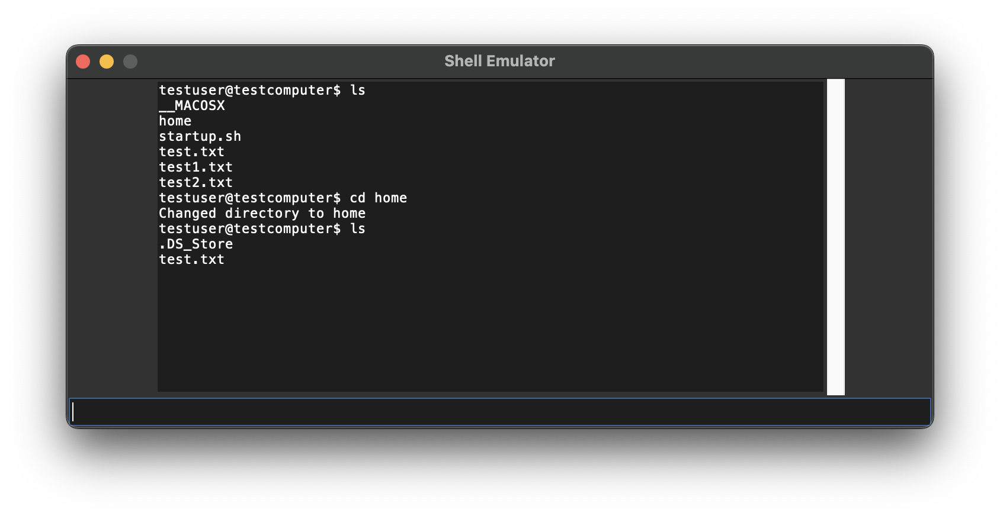

## Клонирование репозитория
Склонируйте репозиторий с исходным кодом и тестами:
```bash
git clone https://github.com/Coolyebaka/Config
cd Config/dz1
```

## Запуск
Запуск эмулятора
```bash
python main.py
```

## Пример работы приложения


## Структура проекта
```bash
tests
 - tests.py # тесты
app.csv # логи проекта
config.json # конфиг для эмулятора
main.py # ядро эмулятора
virtual_fs.zip # виртуальная файловая система
```

## Запуск тестов
```bash
python -m unittest tests/tests.py
```

## Вывод тестов
```
......
------------------------------------------------
Ran 6 tests in 0.021s

OK
```