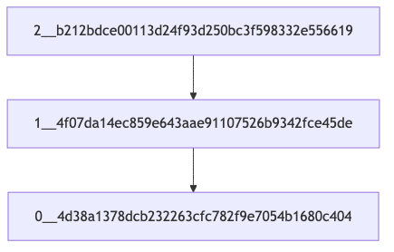

# Git Commit Dependency Graph Visualizer

## Описание

**Git Commit Dependency Graph Visualizer** — это инструмент командной строки для визуализации графа зависимостей коммитов в Git-репозитории, включая транзитивные зависимости. Он строит граф перед заданной датой и показывает зависимость коммитов.

Граф генерируется в формате MERMAID и сохраняется как изображение в формате png.

## Возможности

- **Построение графа зависимостей** для коммитов, перед заданной датой.
- **Полное покрытие кода тестами** с использованием `unittest`.

## Требования

- **Python 3.6+**
- **Git**, установленный и доступный в `PATH`.
- **Mermaid-cli**, установленный и доступный в `PATH`.
- **pygit2** для управления репозеторием.

## Установка

1. **Клонируйте репозиторий или скопируйте файлы проекта**:

   ```bash
   git clone https://github.com/Coolyebaka/Config
   ```

2. **Перейдите в директорию проекта**:

   ```bash
   cd Config/dz2
   ```

3. **Установите необходимые зависимости** (если они не установлены):
   - **Установка `pygit2`**:

     ```bash
     pip install pygit2
     ```

## Использование

Запустите скрипт `main.py`, указав путь_до_репо, дату в формате(год-месяц-дата), название выходного графа:

```bash
python3 main.py /Users/andrei/test 2024-12-20 graph.png
```

После успешного выполнения вы увидите сообщение:

```
Generating single mermaid chart
```

Сгенерированный граф будет сохранен по пути, указанному в комадной строке

## Пример работы скрипта


## Тестирование

Чтобы запустить тесты и убедиться в корректной работе скрипта, выполните:

```bash
pytest -m unittest tests/tests.py
```

Вы должны увидеть вывод, подтверждающий успешное прохождение всех тестов.

## Структура проекта

- **main.py**: Основной скрипт для визуализации графа зависимостей.
- **tests/tests.py**: Набор тестов для проверки корректности работы функций.
- **README.md**: Документация проекта.

## Требования к окружению

Убедитесь, что в вашем окружении:

- **Git** установлен и доступен в командной строке.
- **Python 3.6** или более поздней версии.

## Вывод тестов
```
.....
----------------------------------------------------------------------
Ran 5 tests in 0.002s

OK
```